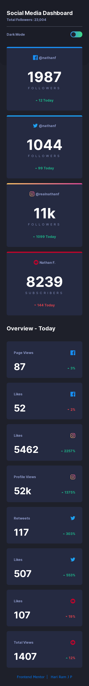
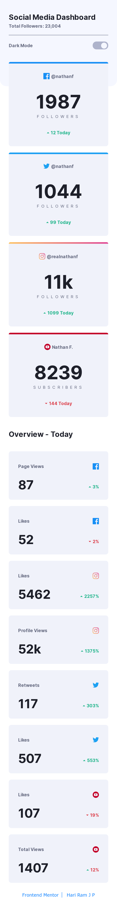

# Frontend Mentor Challenge

## Social Media Dashboard With Theme Switcher [:link:][link]

### Full screenshots

---

- At 1440px :computer:

![At 1440px][at1440px_dark]

---

- At 1440px :computer:

## ![At 1440px][at1440px_light]

- At 375px :iphone:

<table><tr><td></td><td></td></tr></table>

---

<!-- HTML content -->

Hari Ram J P

<a href="https://www.frontendmentor.io/profile/hariramjp777" title="Frontend Mentor Profile" target="_blank">&nbsp;&nbsp;</a>

[link]: https://hariramjp777.github.io/frontend-social-media-dashboard-theme-switcher/ "Live Site"
[at1440px_dark]: ./assets/designs/at1440px_dark.png "At 1440px - dark"
[at1440px_light]: ./assets/designs/at1440px_light.png "At 1440px - light"
